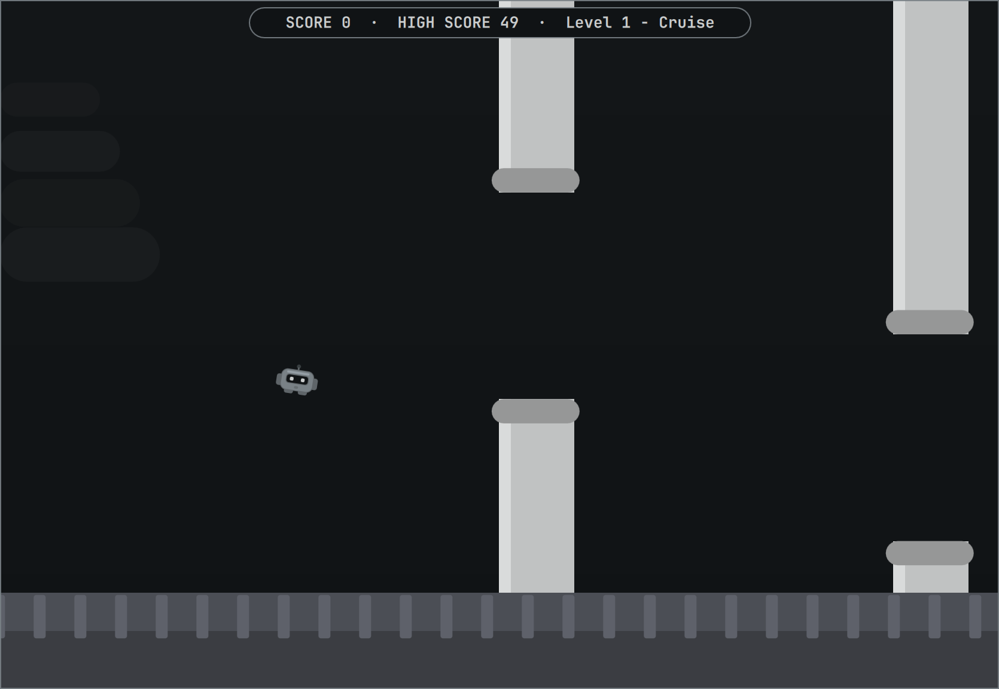
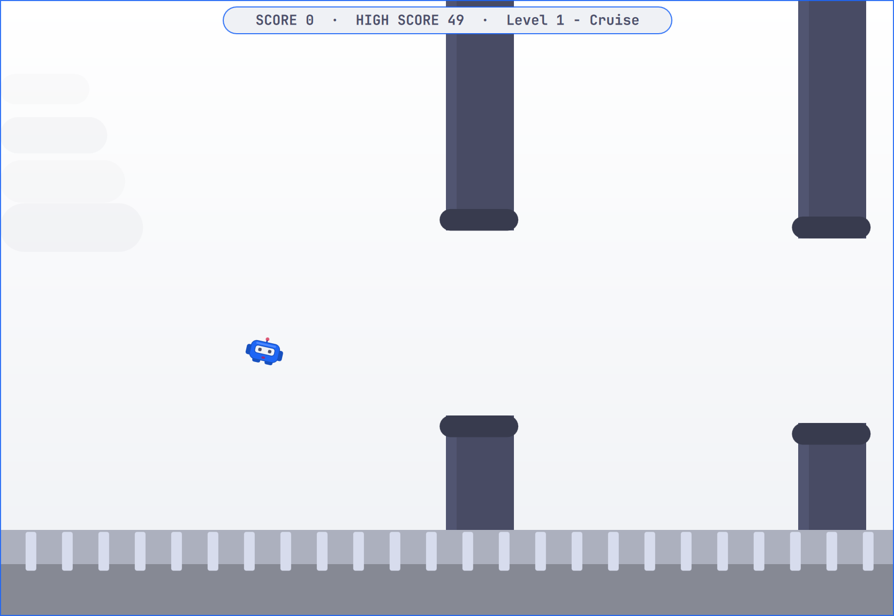
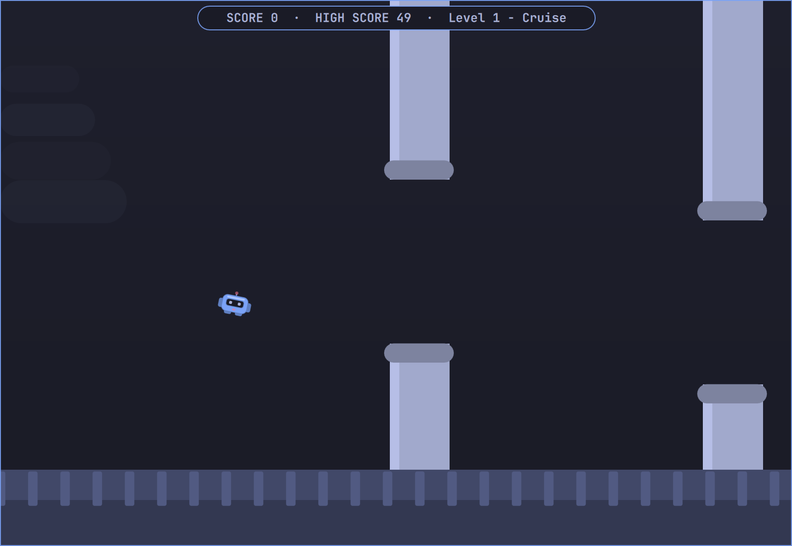

# Flappy Bot

Flappy Bot is a theme-aware, Flappy Bird-style game for
[Omarchy](https://omarchy.org) Quattro. Guide a small robot through an
increasingly challenging obstacle course with simple tap-to-fly controls. Play
in a centered window by default or switch to fullscreen at any time.

## Themes

| Solitude | Catppuccin Latte | Tokyo Night |
|:---:|:---:|:---:|
|  |  |  |

## Install

```sh
omarchy plugin add https://github.com/tonyhuynh/omarchy-flappy-bot.git --enable
```

The plugin adds its robot icon to the right side of the bar. Click it to open
the game. Move it with
`omarchy bar move tonyhuynh.flappy-bot --section center`, replacing `center`
with `left` or `right` as desired.

## Update

```sh
omarchy plugin update tonyhuynh.flappy-bot
```

## Controls

| Input | Action |
|---|---|
| Click or tap | Start, fly, or retry |
| `Space`, `Up`, `W`, or `Enter` | Start, fly, or retry |
| `F` | Toggle centered/fullscreen mode |
| `Esc` | Close |

## Progression

Each cleared pipe increases the challenge slightly as the course speeds up
and its gaps and spacing tighten. After a gentler Cruise start, new levels
arrive at scores 8, 16, and 24: Boost, Turbo, and Overdrive. Flight controls
remain consistent throughout a run.

## Shell commands

Open the overlay:

```sh
omarchy-shell shell summon tonyhuynh.flappy-bot '{}'
```

Open directly in fullscreen mode:

```sh
omarchy-shell shell summon tonyhuynh.flappy-bot '{"mode":"fullscreen"}'
```

Inspect its state:

```sh
omarchy-shell shell call tonyhuynh.flappy-bot status ''
```

Close it:

```sh
omarchy-shell shell hide tonyhuynh.flappy-bot
```

The high score persists at `~/.local/state/omarchy/flappy-bot-best`.

## Remove

```sh
omarchy plugin remove tonyhuynh.flappy-bot
```

## Project files

- `manifest.json` defines the `overlay` and `bar-widget` plugin kinds.
- `BarWidget.qml` provides the robot icon in the Omarchy bar.
- `Overlay.qml` hosts the centered/fullscreen game in a layer-shell `PanelWindow`.
- `Bot.qml` draws the theme-colored 100×72 robot sprite.
- `Pipe.qml` draws each theme-colored obstacle pair.

The plugin uses no external services or network access and has no additional
runtime dependencies.

## License

MIT — see [LICENSE](LICENSE).
